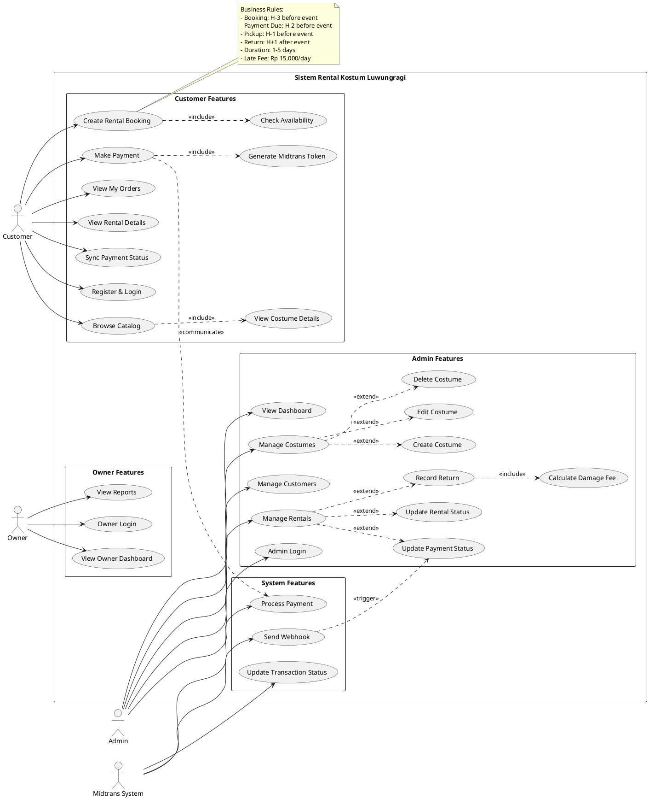
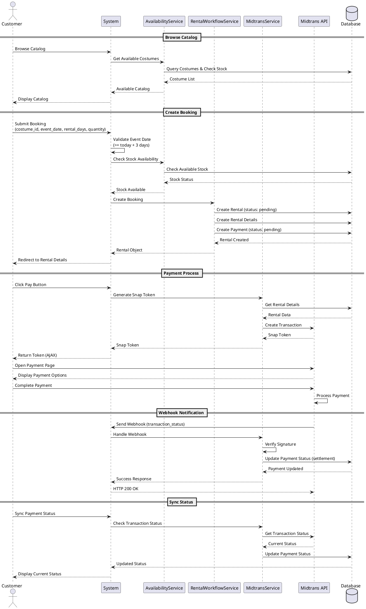
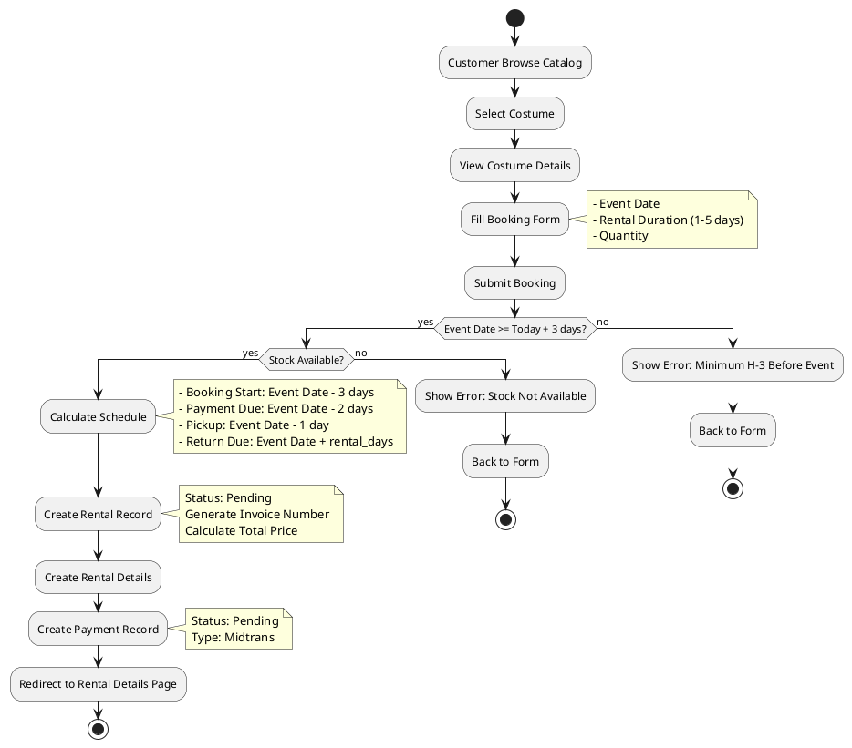
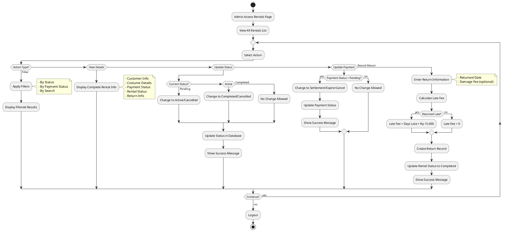
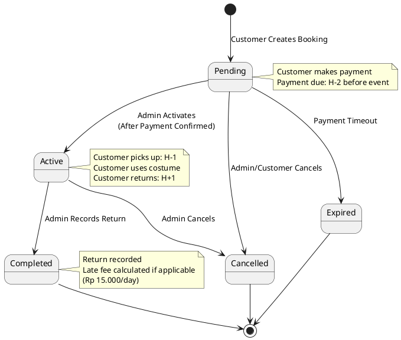
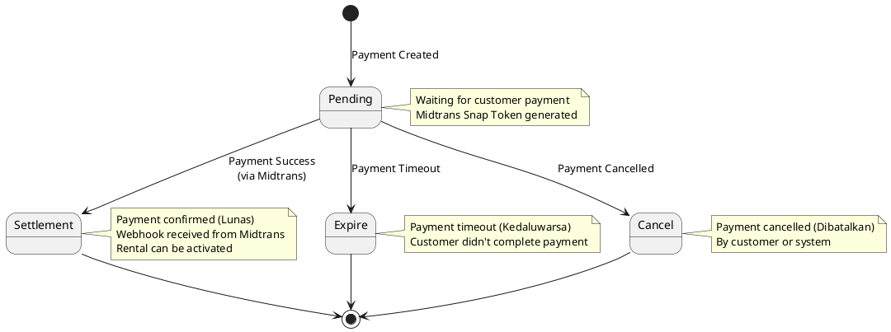
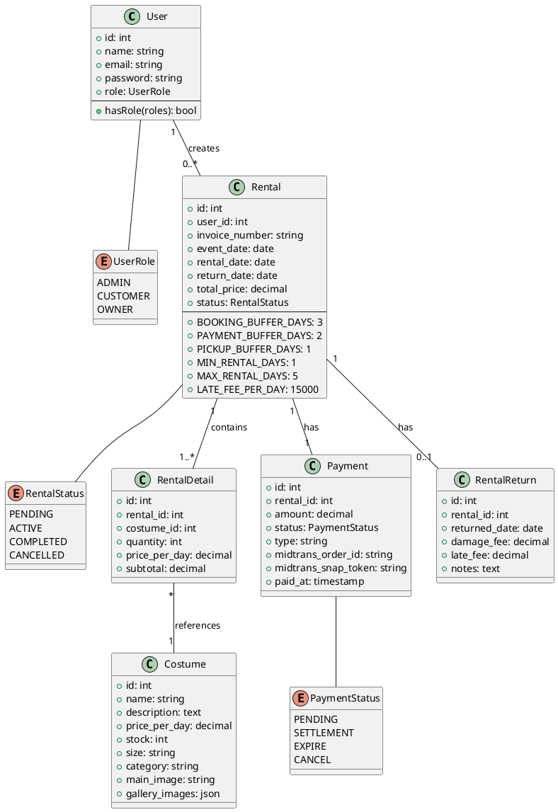
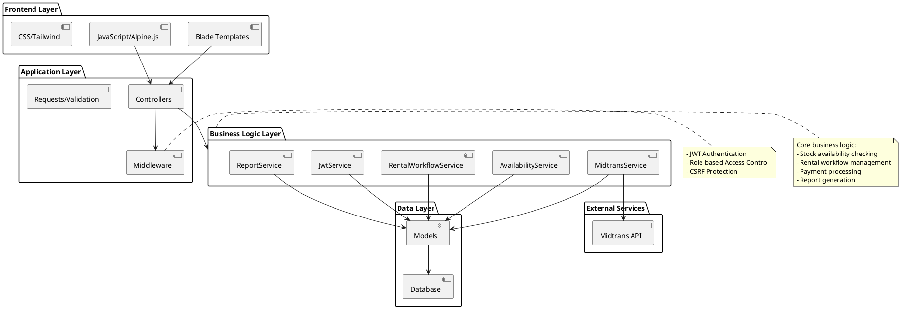
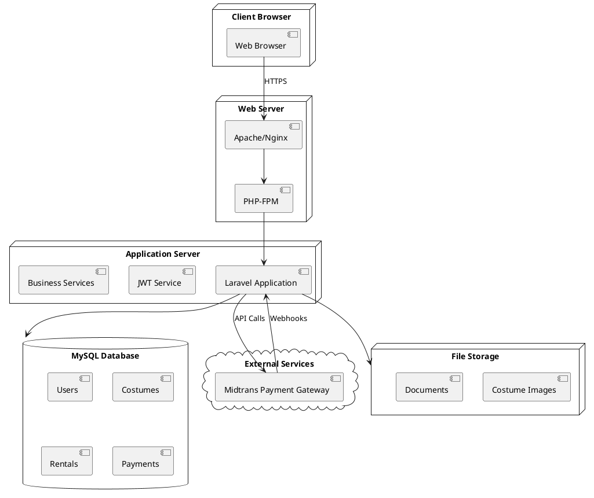
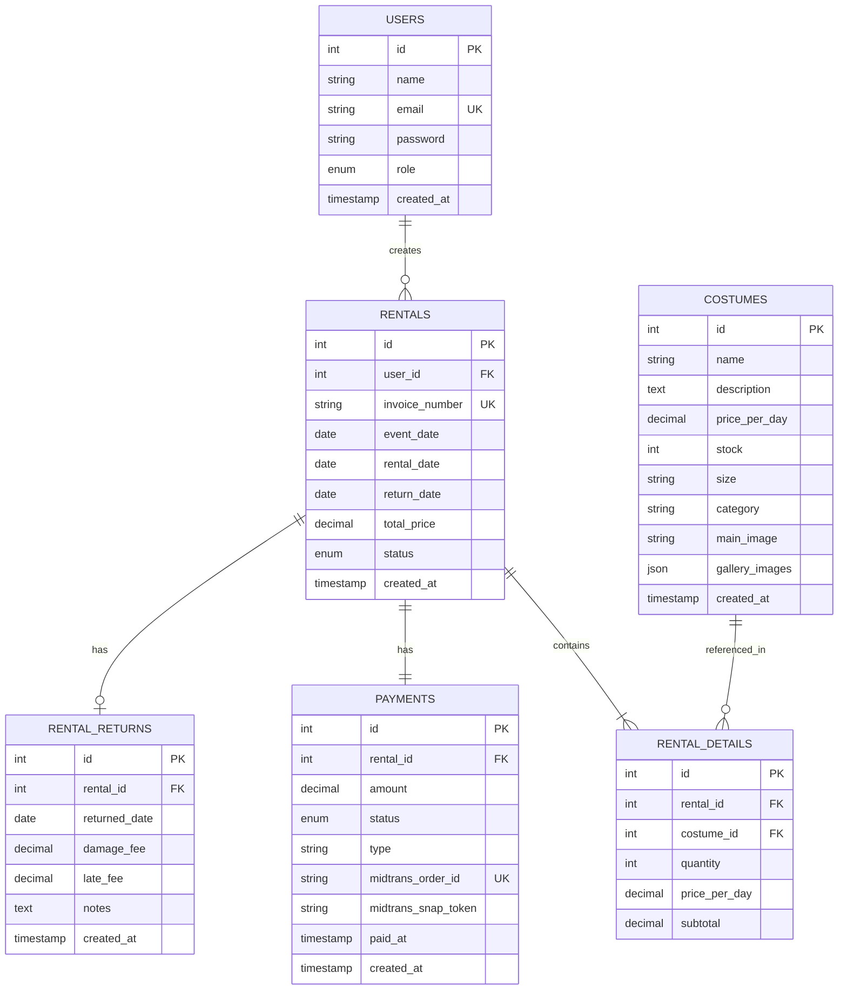

# Diagram untuk Draw.io - Sistem Rental Kostum Luwungragi

## Cara Menggunakan:
1. Buka https://app.diagrams.net/ (draw.io)
2. Pilih "Arrange" > "Insert" > "Advanced" > "Mermaid" atau "PlantUML"
3. Copy-paste kode diagram di bawah ini
4. Atau gunakan plugin Mermaid/PlantUML di draw.io

---

## 1. Use Case Diagram (PlantUML)

---

## 2. Sequence Diagram - Customer Booking & Payment (PlantUML)

---

## 3. Activity Diagram - Customer Booking Process (PlantUML)

---

## 4. Activity Diagram - Admin Manage Rentals (PlantUML)

---

## 5. State Diagram - Rental Status Lifecycle (PlantUML)

---

## 6. State Diagram - Payment Status Lifecycle (PlantUML)

---

## 7. Class Diagram - Main Entities (PlantUML)

---

## 8. Component Diagram - System Architecture (PlantUML)

---

## 9. Deployment Diagram (PlantUML)

---

## 10. ERD - Entity Relationship Diagram (Mermaid)

---

## Cara Import ke Draw.io:

### Untuk PlantUML:
1. Buka draw.io
2. Klik menu "Arrange" → "Insert" → "Advanced" → "PlantUML..."
3. Paste kode PlantUML
4. Klik "Insert"

### Untuk Mermaid:
1. Buka draw.io
2. Klik menu "Arrange" → "Insert" → "Advanced" → "Mermaid..."
3. Paste kode Mermaid
4. Klik "Insert"

### Alternatif (Manual Import):
1. Buka https://plantuml.com/plantuml (untuk PlantUML)
2. Atau https://mermaid.live (untuk Mermaid)
3. Generate diagram
4. Download sebagai PNG/SVG
5. Import ke draw.io

### Tips:
- Gunakan PlantUML untuk diagram yang lebih kompleks
- Gunakan Mermaid untuk diagram yang lebih sederhana
- Sesuaikan styling setelah import ke draw.io
- Simpan dalam format .drawio untuk editing lebih lanjut