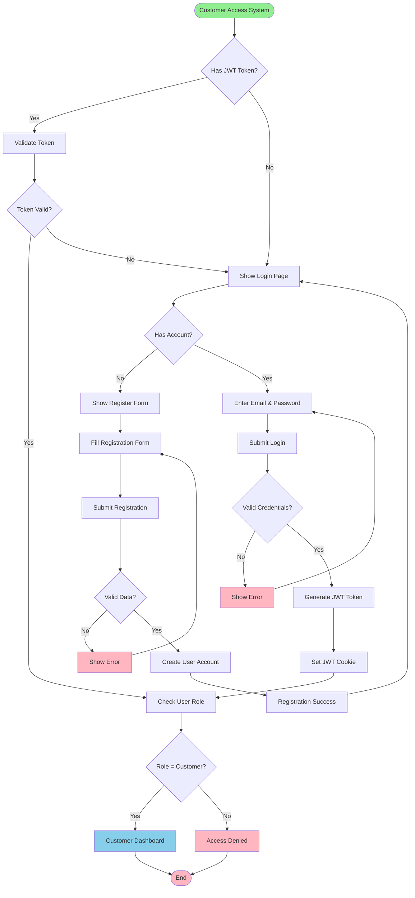
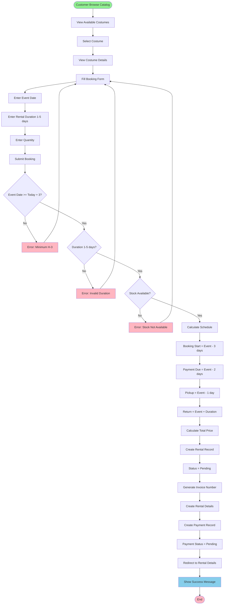
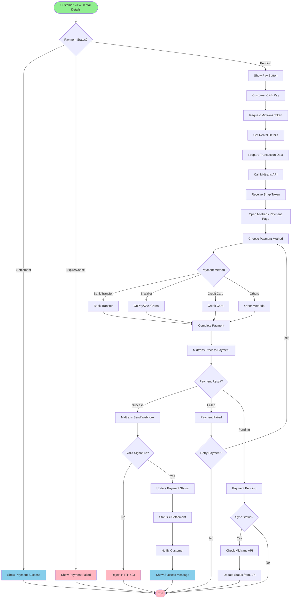
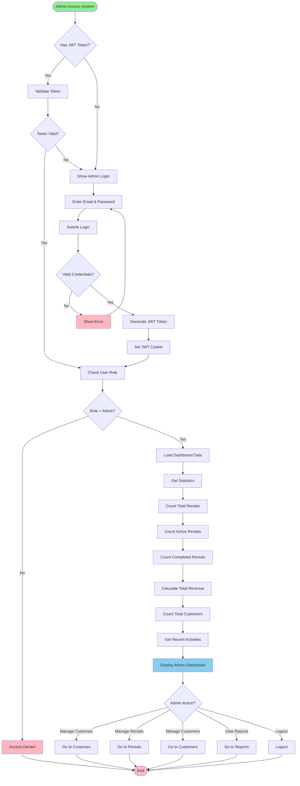
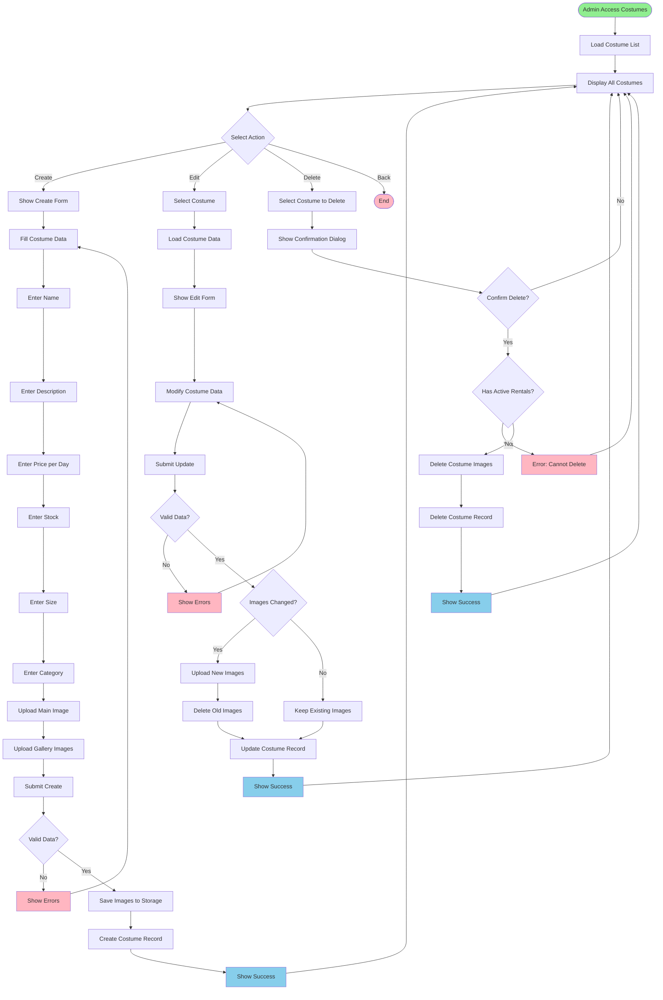
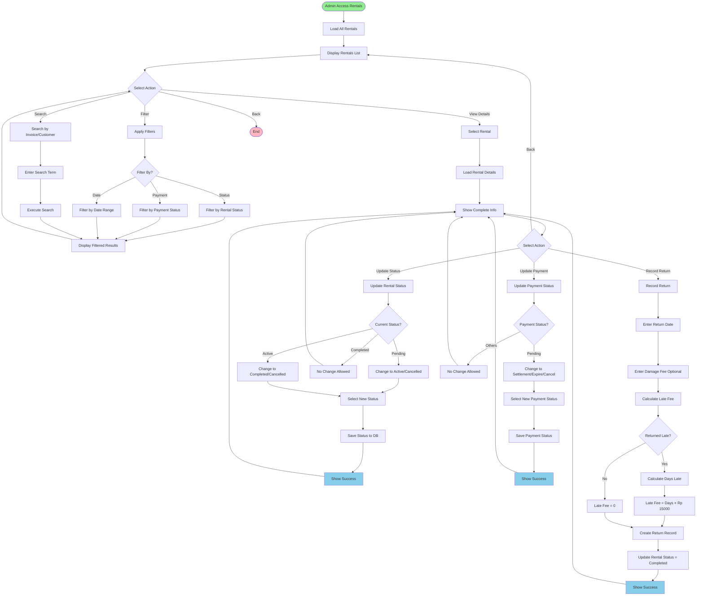
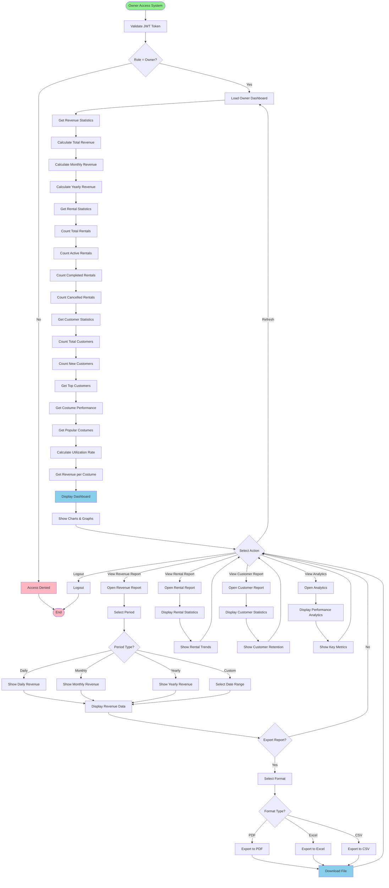
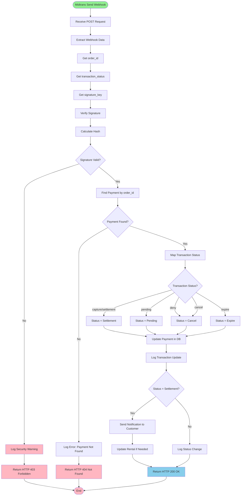
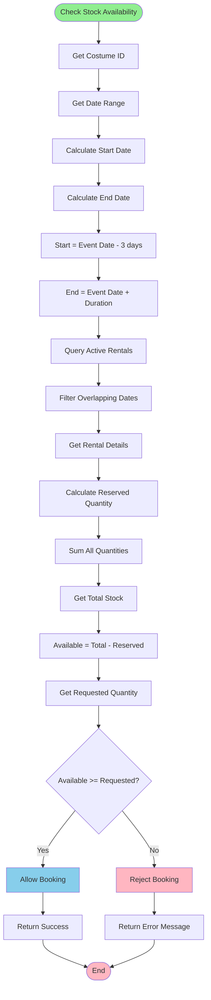
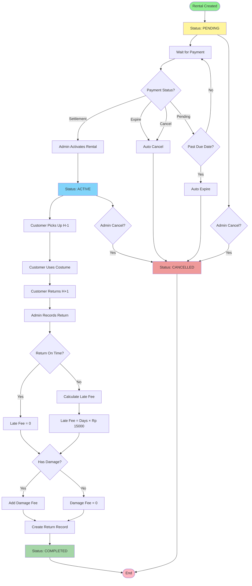

# Flowchart Per Role - Sistem Rental Kostum Luwungragi

## Cara Menggunakan di Draw.io:
1. Buka https://app.diagrams.net/
2. Pilih "Arrange" > "Insert" > "Advanced" > "Mermaid"
3. Copy-paste kode flowchart di bawah
4. Klik "Insert"

---

## 1. Flowchart - Customer Registration & Login

---

## 2. Flowchart - Customer Booking Process

---

## 3. Flowchart - Customer Payment Process

---

## 4. Flowchart - Admin Login & Dashboard

---

## 5. Flowchart - Admin Manage Costumes

---

## 6. Flowchart - Admin Manage Rentals

---

## 7. Flowchart - Owner Dashboard & Reports

---

## 8. Flowchart - Midtrans Webhook Processing

---

## 9. Flowchart - Stock Availability Check

---

## 10. Flowchart - Rental Status Lifecycle

---

## Summary Flowchart

### Customer Flows (3 flowcharts):
1. Registration & Login
2. Booking Process
3. Payment Process

### Admin Flows (3 flowcharts):
4. Login & Dashboard
5. Manage Costumes
6. Manage Rentals

### Owner Flows (1 flowchart):
7. Dashboard & Reports

### System Flows (3 flowcharts):
8. Midtrans Webhook
9. Stock Availability Check
10. Rental Status Lifecycle

**Total: 10 Flowcharts** yang siap di-paste ke draw.io menggunakan format Mermaid!