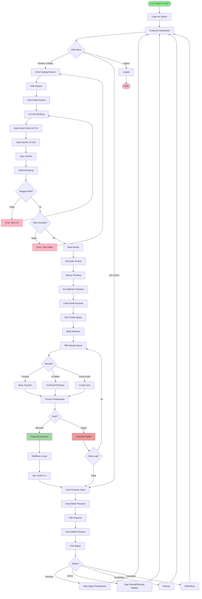
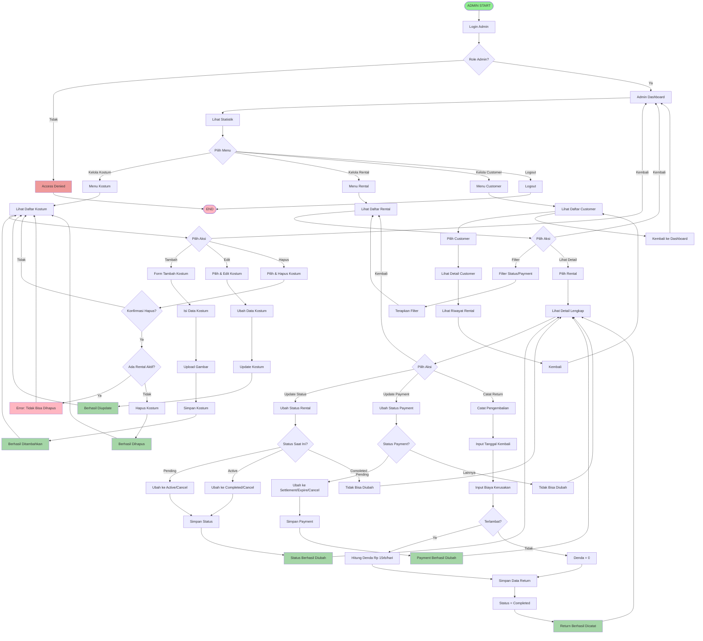
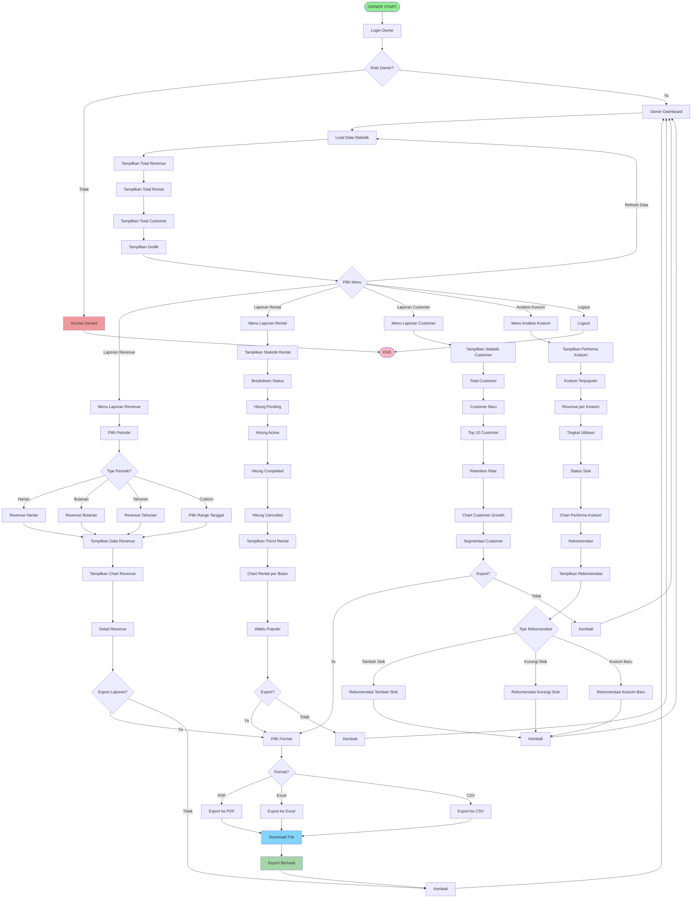
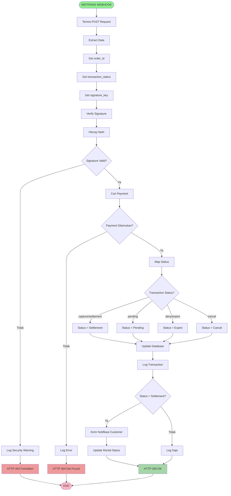
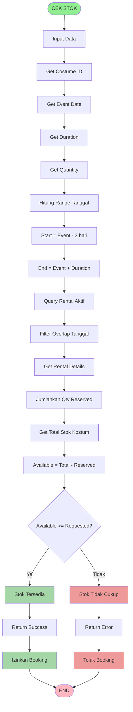
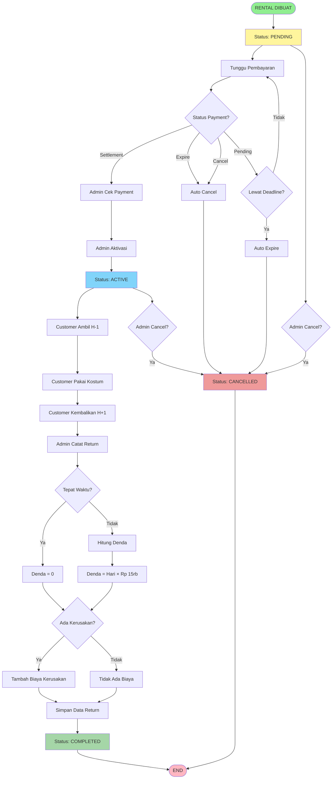

# Flowchart Masing-Masing Role - Sistem Rental Kostum

## Cara Menggunakan di Draw.io:
1. Buka https://app.diagrams.net/
2. Pilih "Arrange" > "Insert" > "Advanced" > "Mermaid"
3. Copy-paste kode di bawah
4. Klik "Insert"

---

## 1. FLOWCHART ROLE: CUSTOMER (PENYEWA)

---

## 2. FLOWCHART ROLE: ADMIN

---

## 3. FLOWCHART ROLE: OWNER

---

## 4. FLOWCHART SISTEM: MIDTRANS WEBHOOK

---

## 5. FLOWCHART SISTEM: CEK KETERSEDIAAN STOK

---

## 6. FLOWCHART SISTEM: LIFECYCLE STATUS RENTAL

---

## RINGKASAN

### Flowchart yang Tersedia:

1. **Customer (Penyewa)** - Flow lengkap dari login, booking, payment, sampai tracking order
2. **Admin** - Flow kelola kostum, rental, payment, return, dan customer
3. **Owner** - Flow dashboard, laporan revenue/rental/customer, analisis, dan export
4. **Midtrans Webhook** - Flow processing webhook dari Midtrans
5. **Cek Stok** - Flow algoritma pengecekan ketersediaan stok
6. **Lifecycle Rental** - Flow perubahan status rental dari pending sampai completed

### Cara Pakai:
- Copy kode Mermaid
- Paste ke draw.io (Insert > Advanced > Mermaid)
- Atau gunakan di https://mermaid.live untuk preview
- Sesuaikan styling sesuai kebutuhan

### Warna:
- 🟢 Hijau = Start
- 🔴 Merah = End / Error
- 🔵 Biru = Success / Info
- 🟡 Kuning = Pending / Warning