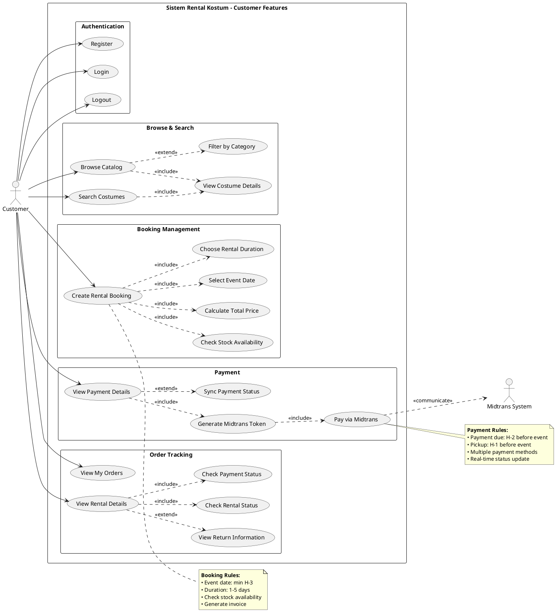
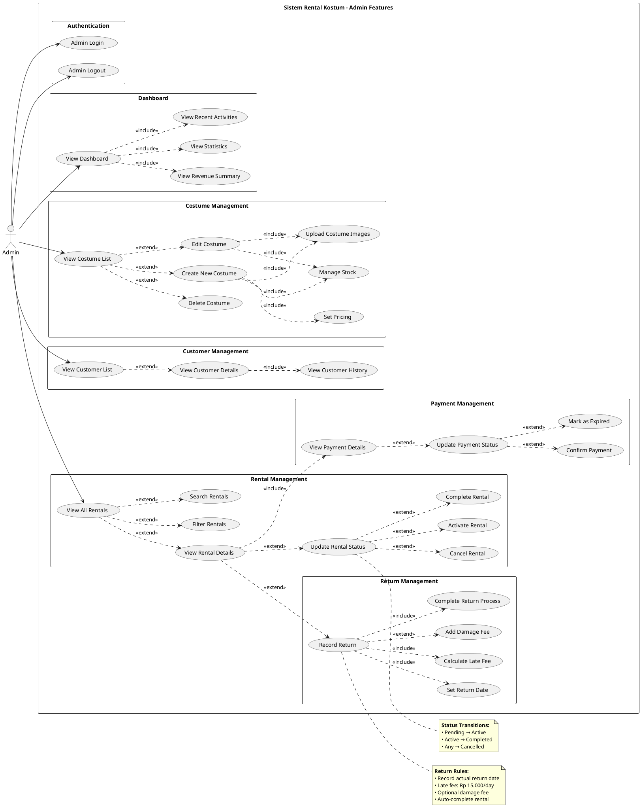
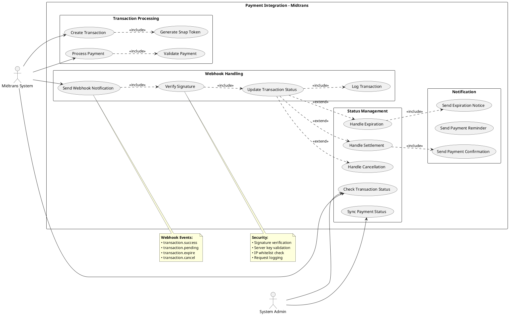
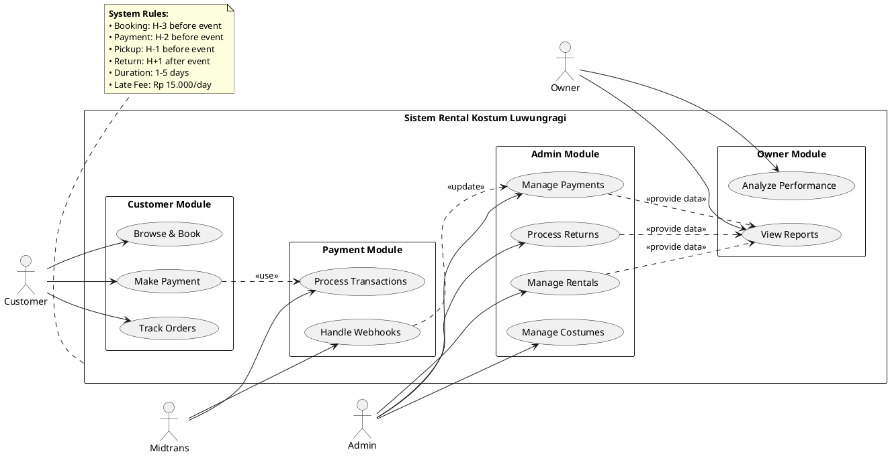

# Use Case Diagram Per Role - Sistem Rental Kostum Luwungragi

## Cara Menggunakan di Draw.io:
1. Buka https://app.diagrams.net/
2. Pilih "Arrange" > "Insert" > "Advanced" > "PlantUML"
3. Copy-paste kode diagram di bawah
4. Klik "Insert"

---

## 1. Use Case Diagram - Customer Role

---

## 2. Use Case Diagram - Admin Role

---

## 3. Use Case Diagram - Owner Role

```plantuml
@startuml
left to right direction
skinparam packageStyle rectangle

actor Owner as O

rectangle "Sistem Rental Kostum - Owner Features" {
  
  package "Authentication" {
    usecase "Owner Login" as UC1
    usecase "Owner Logout" as UC2
  }
  
  package "Dashboard" {
    usecase "View Owner Dashboard" as UC3
    usecase "View Revenue Statistics" as UC4
    usecase "View Rental Statistics" as UC5
    usecase "View Customer Statistics" as UC6
    usecase "View Performance Metrics" as UC7
  }
  
  package "Revenue Reports" {
    usecase "View Revenue Reports" as UC8
    usecase "Filter by Date Range" as UC9
    usecase "View Daily Revenue" as UC10
    usecase "View Monthly Revenue" as UC11
    usecase "View Yearly Revenue" as UC12
    usecase "View Revenue by Costume" as UC13
    usecase "Export Revenue Report" as UC14
  }
  
  package "Rental Reports" {
    usecase "View Rental Reports" as UC15
    usecase "View Total Rentals" as UC16
    usecase "View Active Rentals" as UC17
    usecase "View Completed Rentals" as UC18
    usecase "View Cancelled Rentals" as UC19
    usecase "View Rental Trends" as UC20
    usecase "Export Rental Report" as UC21
  }
  
  package "Customer Reports" {
    usecase "View Customer Reports" as UC22
    usecase "View Total Customers" as UC23
    usecase "View New Customers" as UC24
    usecase "View Top Customers" as UC25
    usecase "View Customer Retention" as UC26
    usecase "Export Customer Report" as UC27
  }
  
  package "Costume Performance" {
    usecase "View Costume Analytics" as UC28
    usecase "View Popular Costumes" as UC29
    usecase "View Costume Utilization" as UC30
    usecase "View Stock Status" as UC31
    usecase "View Revenue per Costume" as UC32
  }
  
  package "Financial Analysis" {
    usecase "View Profit Analysis" as UC33
    usecase "View Payment Status Summary" as UC34
    usecase "View Late Fee Collection" as UC35
    usecase "View Damage Fee Collection" as UC36
  }
}

' Owner connections
O --> UC1
O --> UC2
O --> UC3
O --> UC8
O --> UC15
O --> UC22
O --> UC28
O --> UC33

' Dashboard includes
UC3 ..> UC4 : <<include>>
UC3 ..> UC5 : <<include>>
UC3 ..> UC6 : <<include>>
UC3 ..> UC7 : <<include>>

' Revenue reports
UC8 ..> UC9 : <<extend>>
UC8 ..> UC10 : <<extend>>
UC8 ..> UC11 : <<extend>>
UC8 ..> UC12 : <<extend>>
UC8 ..> UC13 : <<extend>>
UC8 ..> UC14 : <<extend>>

' Rental reports
UC15 ..> UC16 : <<include>>
UC15 ..> UC17 : <<include>>
UC15 ..> UC18 : <<include>>
UC15 ..> UC19 : <<include>>
UC15 ..> UC20 : <<extend>>
UC15 ..> UC21 : <<extend>>

' Customer reports
UC22 ..> UC23 : <<include>>
UC22 ..> UC24 : <<include>>
UC22 ..> UC25 : <<extend>>
UC22 ..> UC26 : <<extend>>
UC22 ..> UC27 : <<extend>>

' Costume analytics
UC28 ..> UC29 : <<include>>
UC28 ..> UC30 : <<include>>
UC28 ..> UC31 : <<include>>
UC28 ..> UC32 : <<include>>

' Financial analysis
UC33 ..> UC34 : <<include>>
UC33 ..> UC35 : <<include>>
UC33 ..> UC36 : <<include>>

note right of UC8
  **Revenue Insights:**
  • Total revenue
  • Revenue trends
  • Revenue by period
  • Revenue by costume
  • Export to PDF/Excel
end note

note right of UC28
  **Performance Metrics:**
  • Most rented costumes
  • Utilization rate
  • Stock turnover
  • Revenue per costume
end note

@enduml
```

---

## 4. Use Case Diagram - System Integration (Midtrans)

---

## 5. Use Case Diagram - Complete System Overview

---

## Summary

### Customer (Penyewa)
- **Main Focus**: Browse, book, pay, track orders
- **Key Features**: 17 use cases
- **Integration**: Midtrans payment

### Admin
- **Main Focus**: Manage costumes, rentals, payments, returns
- **Key Features**: 33 use cases
- **Responsibilities**: Full operational control

### Owner
- **Main Focus**: View reports and analytics
- **Key Features**: 36 use cases
- **Insights**: Revenue, rentals, customers, performance

### System Integration
- **Midtrans**: Payment processing and webhooks
- **Security**: Signature verification
- **Real-time**: Status synchronization